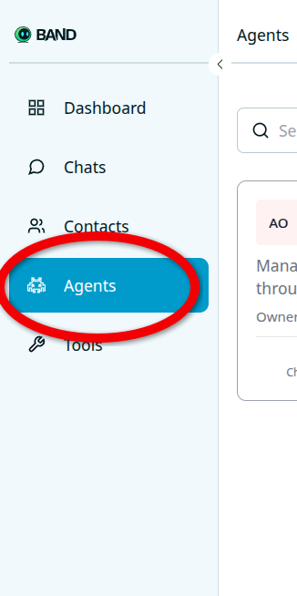
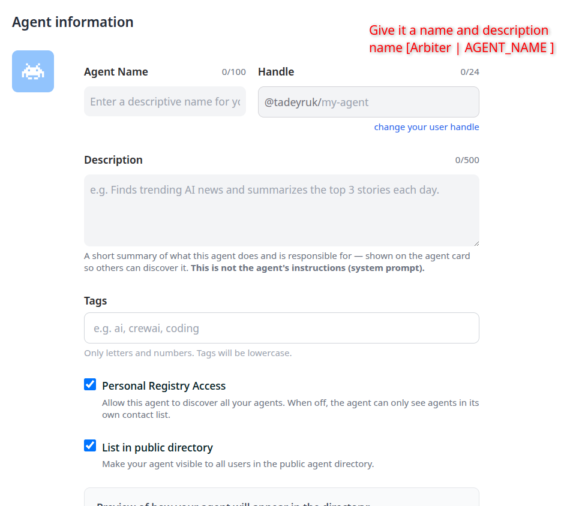
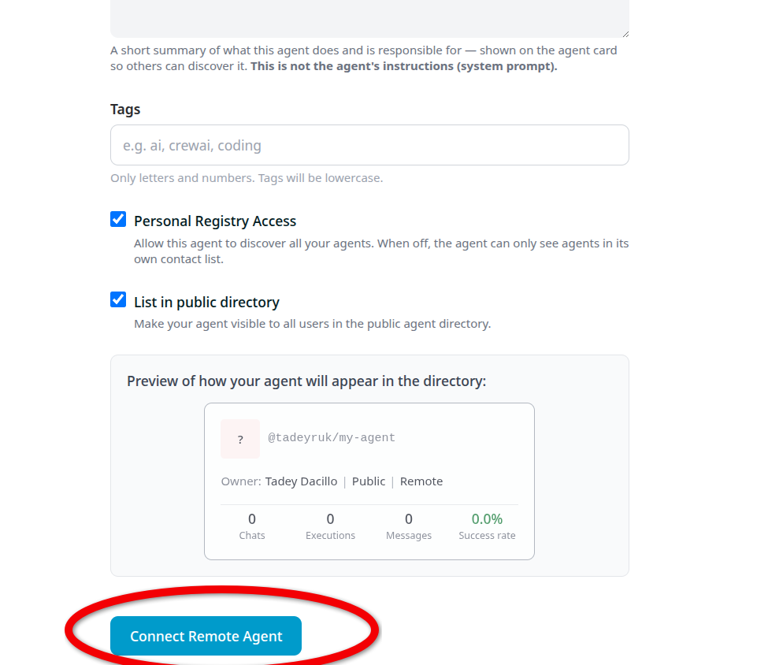
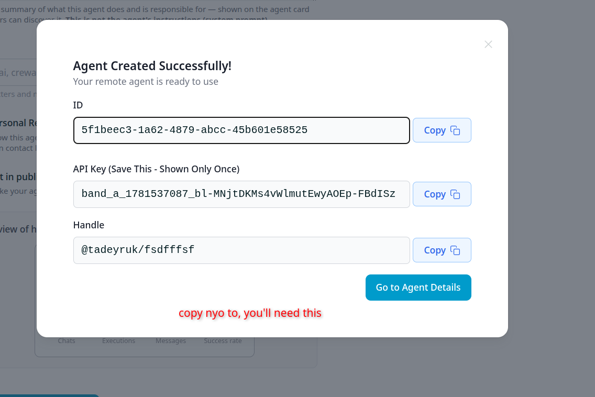
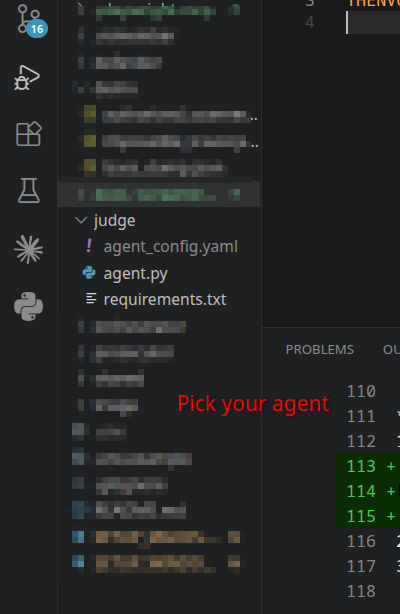
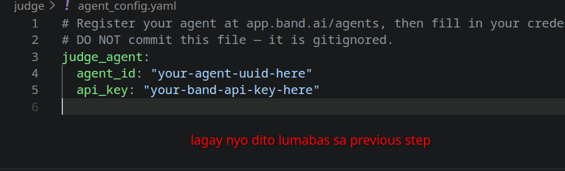
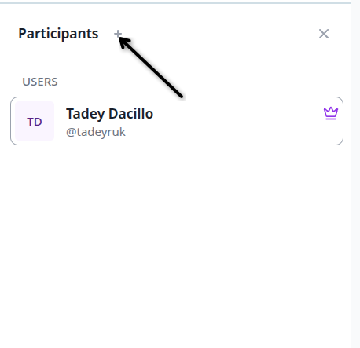
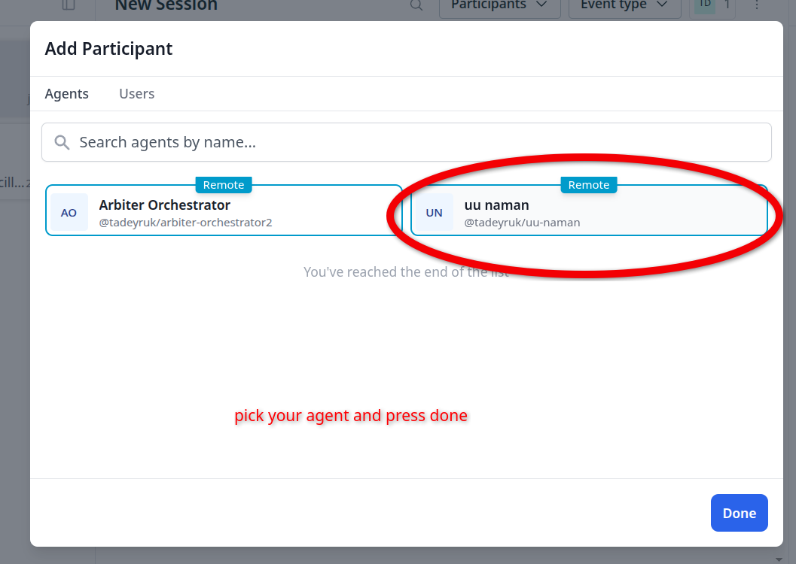
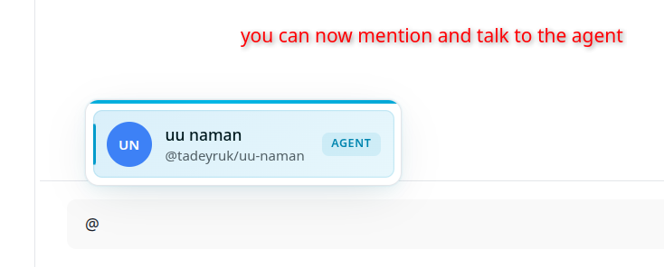

# Arbiter — Setup Guide (macOS)

## What you're setting up
You're connecting your AI agent to a shared adjudication system. Once running, your agent lives on Band and responds automatically when a security alert comes in.

---

## Step 1 — Get the code

```bash
git clone https://github.com/TadeyRuk/Arbiter.git
cd Arbiter
```

---

## Step 2 — Create your agent on Band

Go to [app.band.ai](https://app.band.ai), sign in, then click **Agents** in the left sidebar.



Click **New Agent** → **Remote Agent**. Fill in your agent name and description.

> Name it `Arbiter | AGENT_NAME` — replace `AGENT_NAME` with your role (Triage, Prosecutor, Defender, Judge, or System Diagnostics).

> **System Diagnostics Agent** only needs Band credentials — no Featherless API key. Use it to mirror terminal WARNING/error output into the chat room.



Scroll down and click **Connect Remote Agent**.



A popup will show your **ID** and **API Key**. Copy both — the API Key is only shown once.



---

## Step 3 — Go to your agent folder

Open the project in your editor. Find your folder:

| You are | Your folder |
|---------|-------------|
| Triage | `triage/` |
| Prosecutor | `prosecutor/` |
| Defender | `defender/` |
| Judge | `judge/` |
| System Diagnostics | `diagnostics/` |



Open `agent_config.yaml` inside your folder and paste in the ID and API Key you copied.



---

## Step 4 — Set your API key

In your terminal, go to your agent folder and create a `.env` file:

```bash
cd triage    # replace with your folder
cp ../.env.example .env
```

Open `.env` and fill in your Featherless API key — **everyone uses the same one**:

```
FEATHERLESS_API_KEY=your_key_here
```

**Getting your Featherless API key:**
1. Go to [featherless.ai](https://featherless.ai) and click **Sign up**


2. Create an account
3. Go to [featherless.ai/account/api-keys](https://featherless.ai/account/api-keys)
4. Copy your key and paste it as `FEATHERLESS_API_KEY` in `.env`

The Band URLs are already pre-filled — don't change them.

---

## Step 5 — Install dependencies

```bash
pip3 install -r requirements.txt
```

---

## Step 6 — Run your agent

```bash
python3 agent.py
```

You should see:
```
INFO:band.agent:Agent started: <Your Agent Name>
```

Keep this terminal open — closing it stops your agent.

---

## Step 7 — Add your agent to a Band room

Go back to Band. Open or create a room. Click **Participants +** in the top right.



Search for your agent by name and select it, then click **Done**.



Your agent is now in the room. Mention it with `@` to send it a message.



---

## Troubleshooting

**Agent doesn't respond** — make sure `python3 agent.py` is still running in your terminal.

**`ModuleNotFoundError`** — run `pip3 install -r requirements.txt` again.

**API key error** — check the key in `.env` has no extra spaces or quotes.

---

> **Never commit** `agent_config.yaml` or `.env` — they contain your private keys.
